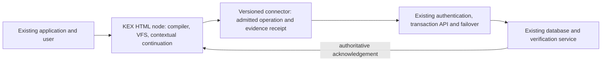

# Formal, market, economic and environmental assessment of KEX HTML runtimes

Prepared 8 October 2026, Australia/Adelaide. This addresses the pasted request for a full analysis and the subsequent clarification that an enterprise can retain its underlying software and server failover design. It uses the supplied executable HTML/code, owner papers, reproduced integration results and external project documentation. [Source register](SOURCE_REGISTER.json) records retrieved material and unsuccessful requests. [Reproducible scenarios](SCENARIOS.json) are assumptions, not customer measurements.

## Finding

The strongest initial product is a governed, locally executing runtime node that augments existing enterprise applications. Its potential economic mechanism is to remove avoidable repeated remote work while preserving authoritative backend transactions and failover. A browser-delivered runtime is a practical distribution and compute placement strategy; KEX's distinctive product proposition is the combination of compiler/assembler, contextual lineage, recurrent continuation, addressable relational state and verified recovery in that delivery format.

This can create commercial value without establishing a new public networking standard or replacing every backend. Rapid deployment is plausible for bounded workloads. Physical rack consolidation requires workload and capacity evidence in addition to runtime correctness.

## Technical evidence and architecture

Evidence already available includes the supplied HTML computer with KEXOneOriginAdapter and virtual-machine asset bindings; four-ray arithmetic and contextual measurement papers; the 4096-cell memory/VFS field; the knowledge-growth package; and runtime/DOM qualification results. The owner adapter passed 4097 roundtrips. The current integrated software passed 38 Python runtime tests, including context-bound genesis, predecessor replay, competing writers, signed/fractional arithmetic and fault recovery. The composed qualifier admitted all 4096 uploaded cells and recovered from simultaneous lineage-store and memory-index faults. Earlier DOM qualification covered 14 pages and 262 local clicks.

These results establish concrete software behaviour within their recorded scope. The current supplied corpus does not contain the separately named v74 stress report in the pasted conversation. Its quoted 0.676% and 6.641 ms figures are preserved as supplied assertions, not relabelled as locally reproduced performance. The pasted discussion ties 0.676% to a byte extension; a file-size percentage cannot alone establish CPU, latency or energy overhead.

The supplied HTML's v86 binding is actual virtual-machine emulation: the upstream project translates x86 machine code to WebAssembly. That capability and ordinary direct JavaScript execution should be measured separately. An HTML distribution still executes through browser and host OS machinery. The packaging can simplify delivery without making the DOM physical bare metal.

A practical additive boundary is:

Where an existing API already accepts the required operation and idempotency/identity fields, underlying business logic can remain unchanged. Adapter work still has to bind authentication, schemas, acknowledgement, conflict handling and rollback. DOM wrapping alone cannot move privileged server-side business logic or trust to an untrusted client.

The correctness target is completed equivalent business work with preserved authority and lineage. Invalid client state is rejected before delivery, and the receiving boundary independently validates admitted operations. Outward contextual records retain origin, ordinance, municipality, region, vector, measurement basis and predecessor relationships; a scalar or content hash does not replace that source context.

## Market and competition

Existing browser and local-first technologies establish buyer familiarity: v86 supports browser-hosted x86; SQLite maintains a WASM build; Automerge provides CRDTs and synchronisation; Electric provides a Postgres-oriented synchronisation layer. These are adjacent building blocks and potential integration partners. The differentiator to demonstrate is a coherent governed execution/continuation and evidence system, not the bare fact that HTML runs code or stores data.

| Initial market | Buyer and workload | Commercial hook | Acceptance evidence |
| --- | --- | --- | --- |
| Enterprise operations | CTO/operations lead; forms, inspections, guided procedures | Keep the backend, reduce session chatter, preserve resumable work | Same business outcomes, fewer avoidable requests, recovery and audit effort |
| Legal/compliance workspaces | Practice operations/compliance; evidence review and structured preparation | Context-preserving source lineage and reproducible workflow | Access boundaries, retention, export provenance and independent review |
| Industrial field tooling | IT/OT integrator; intermittent-connectivity workflows | Portable governed workspace and explicit reconciliation | Device qualification, reconnect correctness, local persistence and safe permissions |
| Developer/agent tooling | Platform engineering; bounded task execution | Reusable compiler/assembler and continuation receipts | Tool admission, predecessor validation, interoperability and measured task completion |
| Infrastructure optimisation | FinOps/data-centre lead; repeated application work | Demonstrate avoidable server capacity and power | Equivalent baseline, host/endpoint meters, invoice reductions and safe standby policy |

Begin with one non-critical enterprise workflow that already has an authoritative transaction API. Legal, healthcare and financial uses may benefit from provenance, but the runtime does not eliminate organisational or regulatory obligations. Critical infrastructure and defence require additional procurement, security, device and independent assurance work; they are later qualification tracks.

Sell a runtime/connector SDK, supported delivery templates and qualification tooling, followed by integration/support subscriptions or a scoped enterprise licence. Pricing should follow verified avoided work and support value. Avoid selling presumed half-rack savings before the customer's workload is measured. Owner IP, third-party dependencies and their licences need a source-backed register before distribution; no exclusivity conclusion is inferred from HTML packaging.

## Economic model

Eligible savings are the work the node actually replaces. Sorting or validation already performed locally by a modern application offers little additional offload benefit. The baseline must be an appropriately configured current application, not an unnecessarily chatty comparison deliberately designed to lose.

Net recurring cash saving = avoidable compute/licensing/support charges minus additional client management, delivery, synchronisation, verification and runtime support. One-time integration, assurance and migration determine payback. Cloud invoice reductions and on-prem electricity savings are separate models; count neither twice.

The reproducible illustrative cloud scenario removes 10 instances priced at 150 currency units/month each, adds 400/month in delivery/verification/support and incurs 10,000 in integration. Net recurring saving is 1,100/month; simple payback is approximately 9.1 months. These are example inputs, not prices obtained from a provider or a customer quotation. A one-week deployment does not imply a one-week financial payback.

Server demand reduction yields no avoidable hosting saving if fixed contracts or reservations remain payable. A data-centre operator may first gain headroom or deferred purchasing rather than immediate cash. Retaining hardware as spare capacity can preserve resilience and delay replacement, but its standby draw and required failover headroom remain part of the calculation.

## Energy and environmental model

The relevant quantity is marginal system energy for the same successfully completed work:

`net watts saved = reduced server watts × marginal facility factor − additional verification/sync facility watts − incremental endpoint/network watts`.

A server with lower utilisation still consumes idle power. A rack power reduction therefore requires consolidation and actual standby/power-state changes, not simply reduced API traffic. Cooling savings depend on the facility's measured marginal response, rather than an assumed linear conversion from average PUE. Client compute is part of the system, even when the enterprise does not pay the device's electricity bill.

The scenario model assumes 10 servers fall from 250 W to 5 W standby, adds 300 W of verification/server demand and uses a 1.3 facility factor. Added endpoint demand then changes the result:

| Assumed average active endpoints | Incremental watts each | Net saving | Annual energy saving |
| --- | --- | --- | --- |
| 200 | 2 W | 2.395 kW | 20,980.2 kWh |
| 1,000 | 2 W | 0.795 kW | 6,964.2 kWh |
| 1,000 | 5 W | −2.205 kW | −19,315.8 kWh |

Annualisation assumes the stated *average* load persists over 8760 hours; it is not a measured occupancy schedule. Incremental endpoint demand must stay below 2.795 kW in this example for a net reduction. Network changes are assumed included/negligible here and must be measured where material. The negative scenario demonstrates why deployment count alone cannot prove an environmental benefit.

Electricity price 0.25 currency units/kWh and operational emissions factor 0.4 kg/kWh are illustrative. Actual regional/node measurements must use their own price, timestamp, grid mix/marginal intensity and duty cycle. Server and endpoint emissions may belong to different regions. Do not transfer a local Australian observation to a global claim without preserving those contexts.

Potential environmental benefits also include deferred new hardware and longer device life. Quantify embodied-carbon avoidance only where a documented purchase/replacement was actually avoided, and account for extra endpoints and standby equipment. Water/cooling effects depend on regional facility technology and cannot be inferred from software size. Robust fibre supports delivery and transactions; it does not remove endpoint compute, synchronisation or physical propagation costs.

The IEA and DOE report URLs were attempted but denied by the environment network proxy. Consequently this assessment does not claim freshly verified global energy totals or extrapolate a global percentage reduction. Official browser/SQLite/v86/Automerge/Electric material was retrieved through available GitHub access. External energy-statistics follow-up remains recorded, rather than substituting quoted conversation claims for source research.

## One-week and one-month actuation plan

Days 1–2: select a workflow and record existing completion rate, requests, CPU time, tail latency, memory, device duty cycle, host/endpoint power and current invoices. Pin source, connector schema and rollback boundaries.

Days 3–4: deploy the node on review devices without changing authoritative business logic. Admit versioned connectors, context and predecessor receipts; exercise local work and backend acknowledgements. Retain existing server failover.

Days 5–7: run matched baseline/KEX sessions across representative devices. Inject missing/corrupt lineage, unavailable storage, duplicate transactions, stale heads, reconnect and backend failover. Report equivalent completed work and observed recovery. A seven-day report can establish pilot feasibility; it cannot qualify an entire enterprise or forecast all seasons.

Weeks 2–3: broaden the device/workload matrix, measure regional contextual load and energy, exercise application reconciliation, verify rights/retention and test peak demand with the original failover reserve.

Week 4: calculate actual avoidable capacity/cost and incremental endpoint energy. Prepare a reviewed consolidation configuration with power-state rollback, recovery-time and recovery-point requirements. Retire or place hardware into standby only under the infrastructure owner's capacity and resilience controls. No shutdown is performed by this analysis.

## Claim and evidence discipline

A deployment is not evidence of universal performance; a source-valid lineage is not immunity to compromised hosts; a logical replica is not an independent hardware failure domain. Browser persistence must be qualified: official MDN documentation distinguishes best-effort and persistent storage, quota exhaustion and user deletion. MDN's web origin is distinct from KEX's governed origin and must have an explicit storage binding.

The current evidence supports executable runtime primitives, typed fault handling, preserved contextual lineage and specific local recoveries. The strongest near-term market claim is: **a governed HTML node can augment existing applications and make selected workloads cheaper, more portable and more recoverable, with savings established by equivalent-work qualification**. The customer's measured performance, financial and environmental results determine how far that claim scales.

Next: run the documented matched-workload pilot with the existing backend connector and record both endpoint and server resource evidence.
