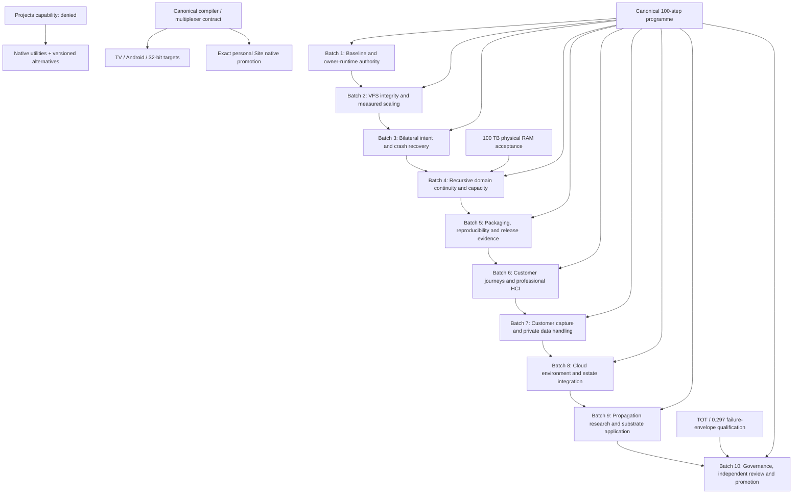

# Dependency and repository map

This diagram describes dependencies; it does not assert a provisioned host, active
Project or promoted Site. Native edges are separately read back.

| Repository family | Responsibility |
| --- | --- |
| [Keddeh1/BRAINK-BETA-TEST](https://github.com/Keddeh1/BRAINK-BETA-TEST) | Owner BRAINK source and runtime integration |
| [Keddeh1/KEDDEH-SOVEREIGN-NAMESPACE-RUNTIME](https://github.com/Keddeh1/KEDDEH-SOVEREIGN-NAMESPACE-RUNTIME) | Canonical programme, namespace and evidence |
| [Keddeh1/Keddeh-SYSTEMS-Virtual-File-Space-ZCG-ARCHITECTURE](https://github.com/Keddeh1/Keddeh-SYSTEMS-Virtual-File-Space-ZCG-ARCHITECTURE) | Bounded private VFS implementation |
| [Keddeh1/SERVERSPACE](https://github.com/Keddeh1/SERVERSPACE) | Estate bindings, APEX and personal Site source |
| [Keddeh1/SERVERSPACE-EXTERNAL](https://github.com/Keddeh1/SERVERSPACE-EXTERNAL) | External server/family admission |
| [Keddeh1/SYSTEMS-SERVICES-FOR-DEPLOYMENT-QUEUE](https://github.com/Keddeh1/SYSTEMS-SERVICES-FOR-DEPLOYMENT-QUEUE) | Deployment queue and release coordination |
| [Keddeh1/Virtual-File-Space-ZCG-ARCHITECTURE](https://github.com/Keddeh1/Virtual-File-Space-ZCG-ARCHITECTURE) | Bounded private VFS implementation |
| [Keddeh1/braink-foundary-schema](https://github.com/Keddeh1/braink-foundary-schema) | Foundry schema/contracts |
| [Keddeh1/keddeh.com](https://github.com/Keddeh1/keddeh.com) | Company frontage candidate |
